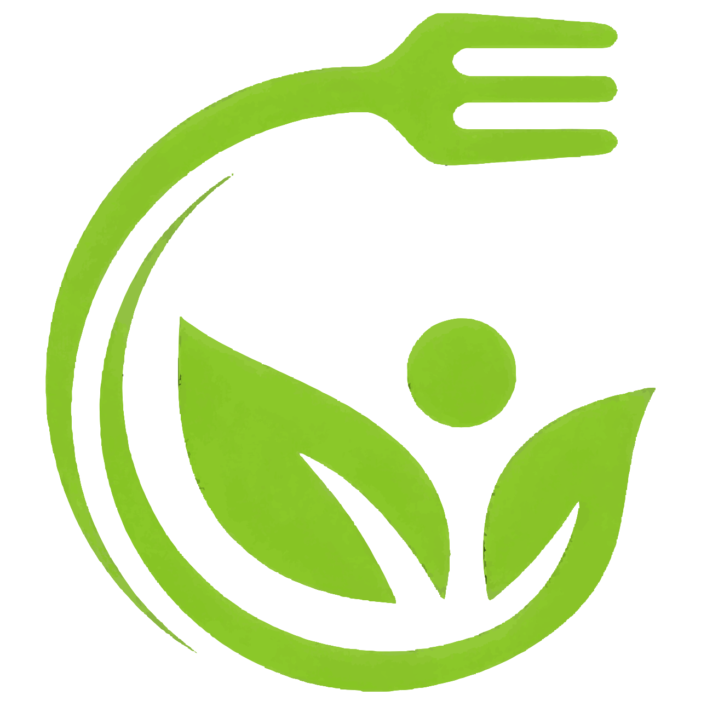

# AgTabanl-ProgramlamaGiris
Bir diyetisyen kliniği için web site oluşturma
[AĞ TABANLI PROGRAMLAMAYA GİRİŞ.pdf](https://github.com/SevvalEsenturk/AgTabanl-ProgramlamaGiris/files/13552484/AG.TABANLI.PROGRAMLAMAYA.GIRIS.pdf)

<!DOCTYPE html>
<html lang="tr">
<head>
    <meta charset="UTF-8">
    <meta name="viewport" content="width=device-width, initial-scale=1.0">
    <title>Document</title>

    <meta charset="UTF-8">
    <meta name="viewport" content="width=device-width, initial-scale=1, shrink-to-fit=no">
    <link rel="stylesheet" href="css/bootstrap.min.css">
    <link rel="stylesheet" href="fontawesome/fontawesome-free-6.4.0-web/css/all.min.css">
    <link rel="stylesheet" href="css/originkod.css">
    <link rel="preconnect" href="https://fonts.googleapis.com">
    <link rel="preconnect" href="https://fonts.gstatic.com" crossorigin>
    <link href="https://fonts.googleapis.com/css2?family=Roboto:ital,wght@0,100;0,300;0,400;0,500;0,700;0,900;1,100;1,300;1,400;1,500;1,700;1,900&display=swap" rel="stylesheet">
</head>
<body>
    

        <!-- Navbar start -->

 
    

        <nav class="navbar navbar-expand-lg navbar-light ">
            
            <a class="navbar-brand ml-1" href="#">DiyetDanışmanı</a>
            <button class="navbar-toggler" type="button" data-toggle="collapse" data-target="#navbarNav"
                aria-controls="navbarNav" aria-expanded="false" aria-label="Toggle navigation">
                
            </button>
            

                <ul class="navbar-nav ml-auto">
                    <li class="nav-item active">
                        <a class="nav-link" href="#">Anasayfa (current)</a>
                    </li>
                    <li class="nav-item">
                        <a class="nav-link" href="#" >Hakkımızda</a>
                    </li>
                    <li class="nav-item">
                        <a class="nav-link" href="#">Hizmetlerimiz</a>
                    </li>
                    <li class="nav-item">
                        <a class="nav-link" href="#">Galeri</a>
                    </li>
                    <li class="nav-item">
                        <a class="nav-link" href="#">İletişim</a>
                    </li>
                    <li class="nav-item ">
                        <a class="nav-link btn ml-5 hover_button " id="insta_button" href="https://www.instagram.com/pluton.dunyasi/" target="_blank" style="background-color: white; color: #0fd20f; border-radius: 0px; box-shadow: 0.1em 0.1em; border: 1px solid #1cbe13;"> İnstagram adresim</a>
                    </li>
                </ul>
            

        </nav>
    

 
<!-- Navbar end -->

<!-- GİRİS BASLANGIC-->

    

      

        
      

    

    

        <h4 style="color: #ffffff; text-decoration: none;">Hemen akıllardaki o soruyu yanıtlayalım!</h4>
        

            <strike style="color: #ffffff; text-decoration: none;" >Maddi olarak yeterli değilim, buna rağmen iyi beslenebilir miyim?</strike> 
            <b>Çok yoğunum, beslenmem için çok vakit ayırmak istemiyorum....</b> 
            <b>Diyet listeleri bana ve günlük tüketim alışkanlıklarıma uygun değil diyorsan doğru adrestesin...</b> 
            
        

    
    

    

        <h2>Sağlıklı beslenmeyi hayatınızın rutini haline getirin!</h2>
        
<b>DİYETİSYEN TANITIMI!!</b>

    

</body>
